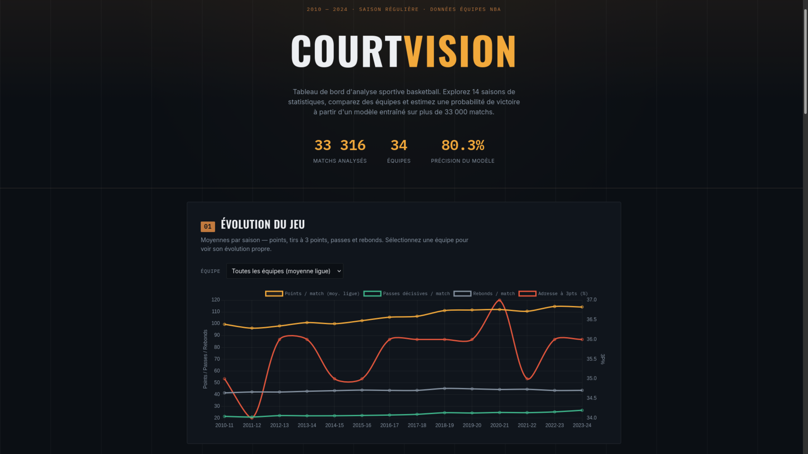

# Court Vision - NBA Analytics Dashboard

Projet réalisé pour l'**AQX Sports Analytics Data Bowl 2.0**.

Tableau de bord d'analyse de données NBA (2010-2024) : évolution du jeu saison après saison, classements, comparateur d'équipes et simulateur de victoire basé sur un modèle de régression logistique.

## Fonctionnalités

- **Évolution du jeu** - moyennes de points, tirs à 3 points, passes et rebonds par saison (globale ou par équipe)
- **Classement** - tri des équipes par % de victoires pour une saison donnée
- **Comparateur d'équipes** - confrontation de deux équipes sur 6 indicateurs clés
- **Simulateur de victoire** - prédiction de probabilité de victoire à partir de statistiques ajustables via curseurs

## Modèle prédictif

Régression logistique entraînée sur 33 316 matchs (2010-2024), à partir des statistiques de match (FG%, 3P%, FT%, rebonds, passes, pertes de balle, interceptions, contres, fautes).

- **Précision** : 80.3%
- **AUC** : 0.89

## Utilisation

1. Générer les données pour le frontend :
   ```bash
   python process_data.py
   ```
   Cela produit dans `frontend/data/` : `team_season_stats.json`, `league_trends.json`, `win_model.json`, `seasons.json`, `teams.json`.

2. Lancer le frontend (fichiers statiques) :
   ```bash
   cd frontend
   python -m http.server 8000
   ```
   Puis ouvrir `http://localhost:8000`.

## Dépendances

- Python : `pandas`, `numpy`, `scikit-learn`
- Frontend : HTML/CSS/JS vanilla + [Chart.js](https://www.chartjs.org/)

## Données

[NocturneBear/NBA-Data-2010-2024](https://github.com/NocturneBear/NBA-Data-2010-2024) (licence MIT).

## Built With

Python (pandas, scikit-learn), HTML, CSS, JavaScript, Chart.js

## Auteur

Evans - Nicolas - [[lien GitHub](https://github.com/EvansRamin/hackathon-1)]
